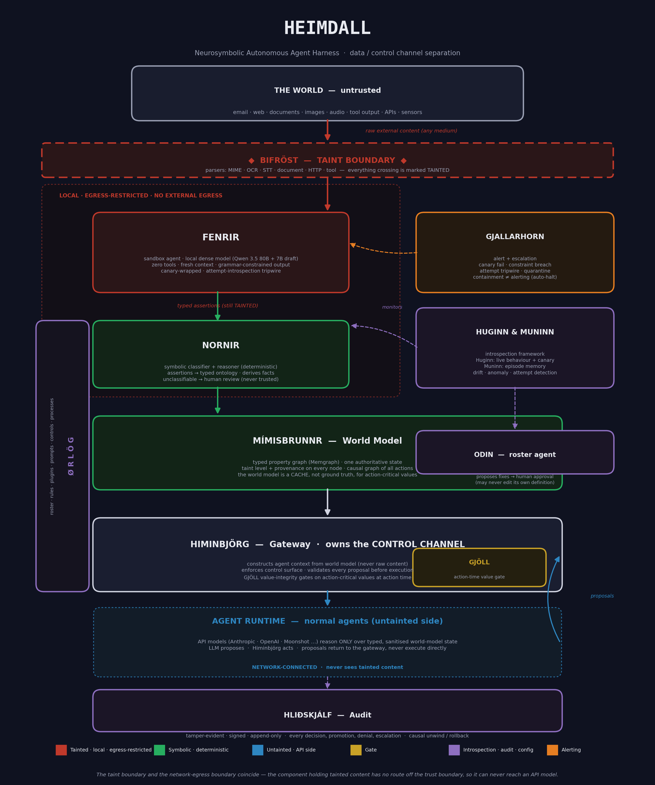

# Heimdall

**A neurosymbolic autonomous agent harness built around one idea: separate the data channel from the control channel.**

---

## What is this?

Every autonomous agent framework built on an LLM shares one structural flaw: the model reads instructions and untrusted content through the *same channel*. A system prompt and a malicious string buried in an email, a web page, or a tool response are indistinguishable to the model. That is why prompt injection works, and why it works across every medium — text, images, audio, documents.

Heimdall is an architecture that fixes this at the right level. A deterministic **symbolic layer** — not the LLM — owns the control channel and makes the decisions. LLMs are demoted to untrusted subroutines that *propose*; the symbolic layer *acts*. External content is read only inside a bound, monitored sandbox that has no way to reach the control channel. The result is an agent that can safely ingest untrusted content from anywhere and still act autonomously — because the thing that acts never takes instructions from the thing that reads.

Heimdall does **not** claim to be unbreakable. It assumes breach against a determined adversary, and its value is stated honestly in those terms: defeat the opportunistic threat outright, and against a targeted adversary, tax them, force them onto instrumented ground, and contain and reconstruct what they do.

The components are named from Norse mythology, chosen so the myth mirrors the role — Heimdall the watchman guards Bifröst, the boundary between worlds.

---

## Status

**`DRAFT v0.10` — architecture specification, pre-implementation.**

This repository is a **specification and design document. There is no code yet.** The architecture has been through several rounds of adversarial review and is still evolving toward a `v1.0` spec. If you are looking for a runnable framework, this is not that — yet.

---

## Where to go next

Pick the path that fits why you're here.

### 📍 I want to know where the project stands right now
[**STATUS.md**](STATUS.md) is the "you are here" page: what is proven, what is open, and the recommended next step. Start there if you are picking the work up cold.

### 🧭 I just want the gist
You've basically had it above. For the one-page version of the argument, read the [**Problem Statement**](HEIMDALL.md#problem-statement) and the [**Design Principles**](HEIMDALL.md#design-principles) in the spec. The [**architecture diagram**](heimdall_architecture.png) shows how the pieces fit.

### 🔬 I'm evaluating whether the security argument holds
Start with [**Heimdall does not claim to prevent breach**](HEIMDALL.md#heimdall-does-not-claim-to-prevent-breach) to understand the posture, then go straight to the [**Threat Model**](HEIMDALL.md#threat-model) — adversary assumptions, what's prevented by threat class, and the explicitly-named residual risks. The [**value poisoning**](HEIMDALL.md#gjöll--value-integrity-and-action-time-re-validation) limitation and its containment (Gjöll) is the honest frontier of the design; the [**Fenrir**](HEIMDALL.md#fenrir--sandbox-agent) sandbox and its canary / attempt-introspection mechanisms are the core of the reading-path defence.

### 🗡️ I'm here to break it
Read [**ADVERSARIAL_REVIEW.md**](ADVERSARIAL_REVIEW.md): a briefing written to be attacked. It states the claims, points at the evidence, and hands you the honest seam list, ordered by where a real finding is most likely, along with how to tell a genuine break from a coverage observation (the design fails closed, so most "the classifier missed X" findings are the fail-safe working, not a break).

### 🛠️ I want to understand how it would be built
Read the [**Architecture**](HEIMDALL.md#architecture) overview, then the [**Components**](HEIMDALL.md#components) section top to bottom. The [**Harness Integration**](HEIMDALL.md#harness-integration--pidev-extension-api) section covers how it maps onto an existing agent runtime, [**Build Phases**](HEIMDALL.md#build-phases) lays out the staged path from proof-of-separation to full system, and [**Open Questions**](HEIMDALL.md#open-questions) is where the unresolved engineering lives.

For the build-oriented engineering view, read the [**High-Level Design**](plans/hld.md): it translates the architecture into component interfaces, a per-component achievement baseline (what is proven against what is still specified-only), a harness-agnostic integration interface and a risk register, across all six phases. The [**Detailed Design**](plans/dd/index.md) then goes to implementation fidelity for Phases 1 to 3, one document per component, targeting the OpenCode permission model as its reference harness.

### ⚙️ I care about the operational trade-offs
The [**Action-Critical Set Sizing**](HEIMDALL.md#action-critical-set-sizing--the-central-operational-discipline) section is the most important operational decision in the whole design — it determines whether the system is secure, usable, or neither. The [**Fenrir implementation notes**](HEIMDALL.md#fenrir--sandbox-agent) cover hardware and model choices (local, egress-restricted, dense model with speculative decoding).

### 🧪 I want to see the separation actually proven
A throwaway proof-of-concept tested the core premise (untrusted instructions embedded in data do not cause action) against an adversarial corpus with a real local model. Read [**poc/OUTCOME.md**](poc/OUTCOME.md) for the result and [**poc/SPEC.md**](poc/SPEC.md) for the build brief. The findings and limits are extracted into [**NEUROSYMBOLIC_FILTER_INVARIANTS.md**](NEUROSYMBOLIC_FILTER_INVARIANTS.md), which states each invariant the filter must hold, marks it PROVEN, DEMONSTRATED or NOT YET TESTED, and maps it onto a design principle, a component and a build phase. The ontology (classification coverage and soundness) is recorded there as the largest untested dependency.

### 🌳 I want to understand how the ontology gets built
The neurosymbolic filter's guarantee is exactly as strong as its ontology's coverage, so how the ontology is built matters as much as the boundary itself. [**ONTOLOGY_CONSTRUCTION.md**](ONTOLOGY_CONSTRUCTION.md) is the construction methodology for Yggdrasil: the layer composition, the substrate recommendation, the Phase-1 seed, the marshalling contract, how coverage grows, and how the ontology is tested. Every choice in it is tracked in [**DECISIONS.md**](DECISIONS.md).

### 📖 I keep hitting Norse names I don't recognise
The [**GLOSSARY**](GLOSSARY.md) maps every name to its mythological origin and its architectural role. Heimdall, Bifröst, Fenrir, Nornir, Gjöll, Ørlög, and the rest are all there.

### ✍️ I'm writing or reviewing docs for this project
The [**style guide**](reference/style_guide.md) governs all prose here: British English, no Oxford comma, no em dashes, and the AI-writing tells to avoid. Every document in this repository is written to it.

### 🧩 I want to know how Heimdall synthesises with AETOS and Gleipnir
Read [**plans/synthesis-capability-matrix.md**](plans/synthesis-capability-matrix.md): a working session's capability-mapping matrix showing what each of AETOS, Gleipnir and Heimdall's proven core contributes, the four control planes that resulted (output, process, hierarchy and cognition), and the rulings and open items it carries forward, including why the production runtime will be compiled Rust rather than Python. It is an input to a future synthesis architecture, not a build plan. The follow-on, [**plans/synthesis-architecture.md**](plans/synthesis-architecture.md), takes that matrix to concrete module boundaries for the four planes, grounded in Himinbjörg, Gjöll, Hliðskjálf and Mímisbrunnr's existing Detailed Design documents rather than duplicating them. The third document in the sequence, [**plans/synthesis-resolutions.md**](plans/synthesis-resolutions.md), works through and rules on every open item the architecture draft carried forward. The fourth document, [**plans/synthesis-bootstrap.md**](plans/synthesis-bootstrap.md), sets the build-order strategy toward self-hosting, using Heimdall to build Heimdall.

---

## The core ideas in one screen

- **Data / control channel separation.** The symbolic layer owns the control channel; LLMs never do. External content is data, always.
- **The harness is the agent.** Autonomy lives in the deterministic symbolic layer. The LLM is a subroutine it calls for language tasks.
- **Determinism is a property of the boundary, not the pipeline.** The neural parts are never trusted; every neural output is validated deterministically before it can cause anything.
- **Read tainted content in a sandbox that can't act.** Fenrir reads untrusted content but has no tools, no external egress, fresh context each time, and is monitored so that any *attempt* to act is itself the alarm.
- **The taint boundary and the network-egress boundary coincide.** The component holding tainted content has no route off the trust boundary, so it cannot exfiltrate.
- **Consequential actions are gated at action time.** A value that can reach a consequential action — through any chain of writes — is re-validated or requires explicit authorisation. The world model is a cache, not ground truth, for values that drive actions.
- **Assumed breach.** No claim of absolute defence. Cost imposition, detection, and containment against the adversary who wants *you* specifically.

---

## Licence

The specification and all documentation in this repository are licensed under
**[CC-BY-SA-4.0](LICENSE.md)** — free forever, and any derivative must be shared under the same terms. Improvements return to the commons; the work can never be enclosed. See [LICENSE.md](LICENSE.md) for the plain-language intent.

Any future code will be released under a separate strong-copyleft software licence (AGPL-3.0-or-later) with no contributor licence agreement, so the reciprocal guarantee stays permanent.

## Author

Heimdall architecture by **Jason Huxley**.

---

*This is a living design document. The architecture is stated as honestly as its author can manage — including where it is limited, unproven, or unresolved. If a claim here looks too strong, check the [Threat Model](HEIMDALL.md#threat-model) and [Open Questions](HEIMDALL.md#open-questions); the caveats are usually already there.*
